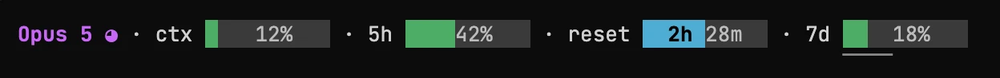

# claudestatus


Claude limits in the Claude Code status line — visible while you work, without `/usage`.



## Install

**Requires macOS 11 or newer, Windows 10 or newer, or Linux with kernel 3.2 or newer.**
The Linux build is statically linked, so the distribution and its glibc do not matter.

macOS and Linux:

```bash
curl -fsSL https://raw.githubusercontent.com/ivan-moskvin/claudestatus/main/install.sh | sh
```

Windows (PowerShell):

```powershell
irm https://raw.githubusercontent.com/ivan-moskvin/claudestatus/main/install.ps1 | iex
```

## Update

```bash
claudestatus update
```

Turn the check off: `CLAUDESTATUS_NO_AUTO_UPDATE=1`.

## Uninstall

```bash
claudestatus uninstall
```

Removes the status line from the settings, the cache, the Divoom panel and the binary itself.

## Commands

```
claudestatus            status line: session JSON on stdin, line on stdout
claudestatus check      check whether a new version is out
claudestatus update     download the latest version and replace itself with it
claudestatus uninstall  remove the status line, the cache and the binary
claudestatus divoom     show the limits on a Divoom Times Gate screen
claudestatus version    print the version
```

## The status line

The model, the current `/effort` level, how full the context is, the five-hour
window, the time until it resets and the weekly window. The circle next to the
model fills up from `low` (`○`) to `max` (`●`). The color of the limit bars
follows usage: green up to 60%, orange up to 85%, red above. The context bar
turns orange and red at the point where the current model starts to lose track
of a long conversation.

## Divoom Times Gate

The same limits — on the screen of a [Divoom Times Gate](https://divoom.com/products/time-gate).


```bash
claudestatus divoom on
```

Finds the device on the network and turns the panel on. From there it updates
itself while a session is running. It takes the fifth screen, which can be
changed to any other: `claudestatus divoom screen 3`.

```
claudestatus divoom on [N]       find the devices and turn the panel on device N
claudestatus divoom off          turn the panel off and give the screen its clock face back
claudestatus divoom              keep the panel updated (works while running)
claudestatus divoom once         send the panel once and exit
claudestatus divoom screen [N]   show or take over screen 1–5
claudestatus divoom preview FILE save a frame to a file without touching the device
```

The device draws the panel by downloading a frame, so on every update the screen
blinks its loading indicator, and frames are not sent faster than it can draw
them.

Talking to the device is not part of this utility: it is
[divoomkit](https://github.com/ivan-moskvin/divoomkit), a crate of its own that
knows nothing about Claude. It finds the devices, draws on a paletted canvas and
keeps a picture on a screen; what stays here is which device you chose and what
goes on the panel. If you want your own data on a Times Gate, take the crate —
what the firmware really does is written down in its
[PROTOCOL.md](https://github.com/ivan-moskvin/divoomkit/blob/main/PROTOCOL.md),
and every line of that was found by trying things on a real device.

## Security

The limits come from Claude Code itself: it feeds the session JSON to the
statusline command on stdin, and that is where the numbers are taken from. No
requests to the Anthropic API, no tokens, no Keychain access — your keys and
your conversations are out of reach for this utility. The numbers are refreshed
only while a session is running.

Two requests go outside, and neither is about you:

- to GitHub — to learn the version of the latest release and download the binary;
- to the Divoom device directory — to ask for the address of your Times Gate on
  the local network. The directory answers by shared public IP and returns the
  address and the model only.

No mail, no passwords, no tokens. Beyond that the bridge works without the
internet: the panel travels to the Times Gate over a local address, and the only
picture handed to it is the one you see on the screen. Nothing but the device
itself can fetch it.
